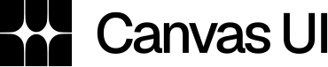

# ASCII 3D Studio

An interactive WebGL 3D ASCII art generator and viewer built with Next.js 16, [@canvas-ui/ascii-object-react](https://canvasui.dev/), Three.js, and shadcn UI following Vercel's minimal design language.



## Features

- **3D ASCII Conversion**: Real-time rendering of SVG, PNG, JPEG, and WebP assets as interactive 3D volumetric ASCII models.
- **Interactive Orbit Controls**: Rotate, pan, zoom, and inspect your 3D ASCII structures in real time.
- **Preset Characters & Custom Sets**:
  - Standard ASCII: ` .:-=+*#%@`
  - Blocks & Shades: ` ░▒▓█`
  - Binary: ` 01`
  - Minimal Dots: ` .:`
  - Custom Charset Input
- **Lighting & Material Controls**:
  - Monochromatic, invert luminance, and full RGB color preservation.
  - Ambient and directional lighting intensity tuning.
  - Font size, character spacing, cell size, and depth extrusion.
- **Auto-Rotation & Physics**: Toggle dynamic turntable rotation with custom speed controls.
- **High-Res Snapshot Export**: Export your generated 3D ASCII scene directly as a transparent or styled PNG.
- **Zero-Scroll Viewport**: Built for full-screen immersive studio workflows without window scrolling.
- **Made with Canvas UI**: Integrated badge linking to [Canvas UI](https://canvasui.dev/).

## Getting Started

### Prerequisites

- Node.js 18+ or Node.js 20+
- npm, pnpm, or yarn

### Installation

```bash
git clone https://github.com/Rachit315/ASCII-3D.git
cd ASCII-3D
npm install
```

### Development Server

```bash
npm run dev
```

Open [http://localhost:3000](http://localhost:3000) with your browser.

### Production Build

```bash
npm run build
npm run start
```

## Tech Stack

- **Framework**: [Next.js 16 (Turbopack)](https://nextjs.org/)
- **ASCII 3D Engine**: [@canvas-ui/ascii-object-react](https://canvasui.dev/)
- **3D Graphics**: [Three.js](https://threejs.org/)
- **UI & Styling**: [Tailwind CSS v4](https://tailwindcss.com/), [shadcn/ui](https://ui.shadcn.com/)
- **Design System**: Vercel Design Language (Geist, achromatic palette, negative tracking)

## License

MIT © [Rachit315](https://github.com/Rachit315)
